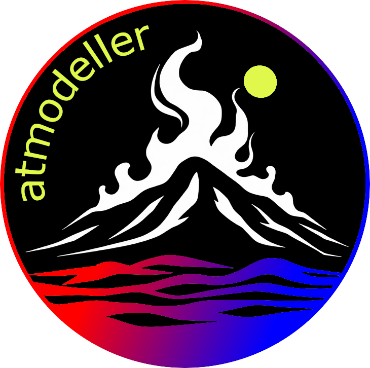

<p align="center">

</p>

# Atmodeller

[](https://www.python.org/downloads/release/python-3100/)
[](https://www.gnu.org/licenses/gpl-3.0)
[](https://github.com/ExPlanetology/atmodeller/actions/workflows/python-package.yml)

## About
Atmodeller is a Python package that leverages [Google JAX](https://jax.readthedocs.io/en/latest/index.html) to compute the partitioning of volatiles between a planetary atmosphere and its rocky interior. It is released under The GNU General Public License v3.0 or later.

## Citation

If you use Atmodeller please cite (prior to manuscript submission, check back to see if this reference has been updated):

- Bower, D.J, Thompson, M. A., Tian, M., and Sossi P.A. (2025), Diversity of rocky planet atmospheres in the C-H-O-N-S-Cl system with interior dissolution, The Astrophysical Journal, to be submitted.

## Development

Community development of the code is strongly encouraged so please contact the lead developer if you or your team would like to contribute. Atmodeller uses JAX so familiarise yourself with [How to think in JAX](https://jax.readthedocs.io/en/latest/notebooks/thinking_in_jax.html) and  [JAX - The Sharp Bits](https://jax.readthedocs.io/en/latest/notebooks/Common_Gotchas_in_JAX.html), as well as other resources offered on the JAX site and the web in general. You are welcome to enquire about the reasoning behind the structure and design of the code with the development team. Please add a corresponding unit test for new features that you develop.

Current development team:

- Dan J. Bower (lead developer, ETH Zurich)
- Maggie A. Thompson (ETH Zurich/Carnegie)
- Meng Tian (LMU Munich)
- Paolo Sossi (ETH Zurich)

## Basic usage

There are Jupyter notebooks in `notebooks/` that provide code snippets for how to perform single and batch calculations, as well as include Atmodeller into a time integration.


Atmodeller contains three sub-packages that provide real gas equations of state (EOS), solubility laws, and thermodynamic data

Accessing real gas EOS:

```
from atmodeller.eos import get_eos_models

eos_models = get_eos_models()
# Find the available models
eos_models.keys()

# Get a CH4 model
CH4_eos_model = eos_models['CH4_beattie_holley58']
# Compute the fugacity at 800 K and 100 bar
CH4_eos_model.fugacity(800, 100)
# Compute the compressibility factor at the same conditions
CH4_eos_model.compressibility_factor(800, 100)
# Etc., other methods are available to compute other quantities
```

Accessing solubility laws:

```
from atmodeller.solubility import get_solubility_models

sol_models = get_solubility_models()
# Find the available models
sol_models.keys()
CO2_basalt = sol_models["CO2_basalt_dixon95"]
# Compute the concentration at fCO2=0.5 bar, 1300 K, and 1 bar
# Note that fugacity is the first argument and others are keyword only
CO2_basalt.concentration(0.5, temperature=1300, pressure=1)
```

Accessing thermodynamic data for species:

```
from atmodeller.thermodata import get_thermodata

species_data = get_thermodata()
# Find the available species
species_data.keys()
# Get CO2 gas
CO2_g = species_data["CO2_g"]
# Compute the Gibbs energy relative to RT at 2000 K
CO2_g.get_gibbs_over_RT(2000.0)
# Compute the composition
CO2_g.composition
# Etc., other methods are available to compute other quantities
```

Running a model:

```
from atmodeller import Species, InteriorAtmosphere, Planet, earth_oceans_to_hydrogen_mass
from atmodeller.solubility import get_solubility_models
import numpy as np

solubility_models = get_solubility_models()
# Get the available solubility models
logger.info("solubility models = %s", solubility_models.keys())

H2_g = Species.create_gas("H2_g")
H2O_g = Species.create_gas("H2O_g", solubility=solubility_models["H2O_peridotite_sossi23"])
O2_g = Species.create_gas("O2_g")

species = (H2_g, H2O_g, O2_g)
planet = Planet()
interior_atmosphere = InteriorAtmosphere(species)

oceans = 1
h_kg = earth_oceans_to_hydrogen_mass(oceans)
o_kg = 6.25774e20
mass_constraints = {
    "H": h_kg,
    "O": o_kg,
}

# If you do not specify an initial solution guess then a default will be used
# Initial solution guess number density (molecules/m^3)
initial_log_number_density = 50 * np.ones(len(species), dtype=np.float_)

interior_atmosphere.initialise_solve(
    planet=planet,
    initial_log_number_density=initial_log_number_density,
    mass_constraints=mass_constraints,
)
output = interior_atmosphere.solve()

# Quick look at the solution
solution = output.quick_look()

# Get complete solution as a dictionary
solution_asdict = output.asdict()
logger.info(solution_asdict)

# Write the complete solution to Excel
output.to_excel("example_single")
```


## Installation

Atmodeller is a Python package that can be installed on a variety of platforms (e.g. Mac, Windows, Linux).

### Quick install

If you want to use a GUI to install the code, particularly if you are a Windows or Spyder user, see [here](https://gist.github.com/djbower/c82b4a70a3c3c74ad26dc572edefdd34). Otherwise, follow the instructions below to install the code using the terminal on a Mac or Linux system.

### 1. Obtain the source code

Navigate to a location on your computer and obtain the source code. To clone using ssh, where you must use a password-protected SSH key:

    git clone git@github.com:ExPlanetology/atmodeller.git
    cd atmodeller

Instructions for connecting to GitHub with SSH are available [here](https://docs.github.com/en/authentication/connecting-to-github-with-ssh).

If you do not have SSH keys set up, instead you can clone using HTTPS:

    git clone https://github.com/ExPlanetology/atmodeller.git
    cd atmodeller

### 2. Create a Python environment

The basic procedure is to install Atmodeller into a Python environment. For example, if you are using a Conda distribution to create Python environments (e.g. [Anaconda](https://www.anaconda.com/download)), create a new environment to install Atmodeller. Atmodeller requires Python >= 3.10:

    conda create -n atmodeller python
    conda activate atmodeller

### 3. Install into the environment

Install Atmodeller into the environment using either (a) [Poetry](https://python-poetry.org) or (b) [pip](https://pip.pypa.io/en/stable/getting-started/). If you are a developer you will probably prefer to use Poetry and if you are an end-user you will probably prefer to use pip. This [Gist](https://gist.github.com/djbower/e9538e7eb5ed3deaf3c4de9dea41ebcd) provides further information.

#### 3a. Option 1: Poetry

This requires that you have you have [Poetry](https://python-poetry.org) installed:

    poetry install

#### 3b. Option 2: pip

Alternatively, use `pip`, where you can include the `-e` option if you want an [editable install ](https://setuptools.pypa.io/en/latest/userguide/development_mode.html).

    pip install .

If desired, you will need to manually install the dependencies for testing and documentation (these are automatically installed by Poetry but not when using `pip`). See the additional dependencies to install in `pyproject.toml`.

### Developer install

See this [developer setup guide](https://gist.github.com/djbower/c66474000029730ac9f8b73b96071db3) to set up your system to develop Atmodeller using [VS Code](https://code.visualstudio.com) and [Poetry](https://python-poetry.org).

## Documentation

Documentation will eventually be available on readthedocs, but for the time being you can compile (and contribute if you wish) to the documentation in the `docs/` directory. To compile the documentation you will need to use Poetry and the option `--with docs` when you run `poetry install`. See [here](https://python-poetry.org/docs/managing-dependencies/) for further information.

Once the necessary dependencies are installed to compile the documentation, you can navigate into the `docs/` directory and run:

	make html
	
And/or to compile the documentation as a PDF (`latexpdf` must be available on your system):

	make latexpdf
	
	
This will build the documentation in the appropriately named subdirectory in `_build`.

## Tutorial

Several Jupyter notebook tutorials are provided in `notebooks/`.

## Tests

You can confirm that all tests pass by running `pytest` in the root directory of Atmodeller. Please add more tests if you add new features. Note that `pip install .` in the *Quick install* instructions will not install `pytest` so you will need to install `pytest` into the environment separately.
